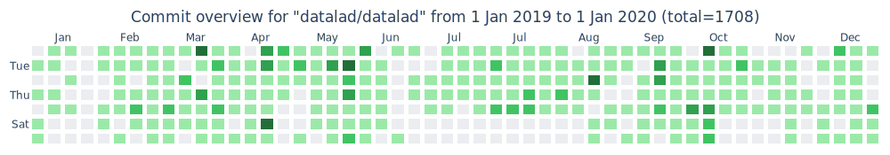

# gitbricks

[UNDER CURRENT DEVELOPMENT]

Plot a bunch of colorful bricks! 



GitHub-inspired calendar heatmap of the commit history of a git repository.

Uses PyGitHub and Plotly.

## Installation

In a virtual environment:
```
git clone https://github.com/jsheunis/gitbricks.git
cd gitbricks
pip install .
# or for developers:
pip install . -e
```

## Usage

### 1. Create a GitHub personal access token and set as environment variable

This is necessary so as not to be rate-limited when using the GitHub API.

Create or find your personal access token [here](https://docs.github.com/en/authentication/keeping-your-account-and-data-secure/creating-a-personal-access-token).

Set it as an environment variable `GITHUB_TOKEN`:

```
export GITHUB_TOKEN="your-personal-access-token"
```

### 2. Call `gitbricks` from the command line

Example:
```
gitbricks -r "datalad/datalad" -y 2019 -m 1
```
Arguments:
- `-r / --repo_name` (string): GitHub repository in the format `org-or-user-name/repository-name`, e.g. `datalad/datalad`
- `-y --start_year` (integer): Start year of bricks, e.g. `2019`
- `-m --start_month` (integer): Start month of bricks (integer), where January=1 and December=12

### 3. Outputs

ThE call above saves two files in the working directory:

- `commit_overview.svg` (example above)
- `commit_overview.html` (interactive figure)

## TODOS

- Heavy code cleanup / refactoring
- Fix calendar date padding at the end
- Add support for leap years
- Add arguments (outputdir, colormap, styling options, custom dates, user commits, more hover functionality)
- Create Dash app deployed on Heroku
- Implement OAuth / GitHub app authentication

## Contributing

Please feel free to create an issue or send a pull request!
